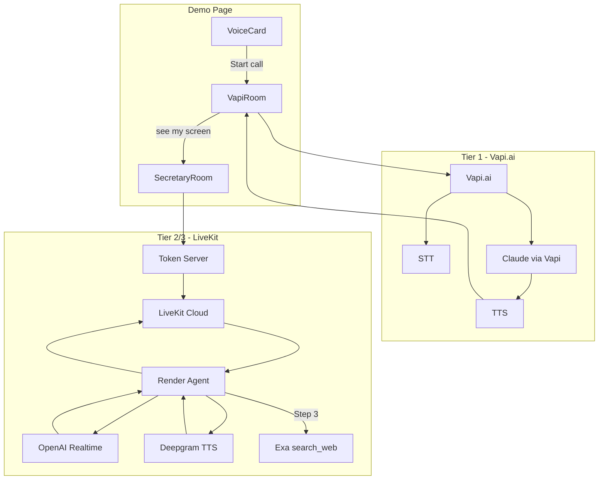

# Clarte Voice Pipeline Explained

How OpenAI Realtime, Vapi.ai, Exa AI, and the Clarte voice agent work together.

## Overview

Clarte supports two connection paths. The demo page uses **Vapi.ai** by default. When the user says "see my screen" or "look at me", **SecretaryRoom** (LiveKit) mounts to provide screen/camera context to Vapi. The full **LiveKit Room** path uses OpenAI Realtime + Exa when the user explicitly switches to it.

## Pipeline Diagram

## Component Roles

| Component | Role |
|-----------|------|
| **Vapi.ai** | Tier 1 (demo default). Handles STT, LLM (Claude), TTS end-to-end. Browser connects directly. No Exa in this path unless you configure tools in the Vapi assistant. |
| **OpenAI Realtime** | Used only in LiveKit path. Single model (gpt-realtime-1.5) for STT + LLM. No separate STT/LLM calls. |
| **Exa AI** | Used by the LiveKit agent via `search_web` tool (Step 3). Returns URLs and snippets. Not used in Vapi path unless Vapi assistant has similar tools. |
| **LiveKit** | WebRTC transport. Connects browser to Render agent. Used for screen share (SecretaryRoom) and full Room when user switches. |
| **Render Agent** | Python agent. Uses OpenAI Realtime + Deepgram TTS. Calls Exa when `search_web` is invoked. |

## When Exa Is Used

Exa is used only in the **LiveKit path** (full Room, not SecretaryRoom). The agent follows a 3-step structure:

1. **Step 1 – Inquiry:** No tools. Ask back.
2. **Step 2 – Debate:** No search. Give feedback.
3. **Step 3 – Reality Check:** Use `search_web` (Exa) for research. Summarize in 1–2 sentences.

When the agent cites a source from Exa, it formats as `[cited sentence](url)` so the live transcript can render it as a clickable link.

## Demo Flow

- **Default:** VapiRoom connects to Vapi.ai. Voice, transcript, and assistant behavior come from the Vapi assistant (configured in Vapi Dashboard).
- **"See my screen":** SecretaryRoom mounts. User shares screen/camera. Secretary agent analyzes frames and sends context to Vapi via `add-message`. Vapi continues to handle voice.
- **Full LiveKit:** When the user switches to LiveKit Room (e.g. via legacy flow), the Render agent handles everything: OpenAI Realtime (STT+LLM), Deepgram TTS, and Exa for search.

## Environment Variables

| Variable | Path | Purpose |
|----------|------|---------|
| `NEXT_PUBLIC_VAPI_PUBLIC_KEY` | Frontend | Vapi.ai public key |
| `NEXT_PUBLIC_VAPI_ASSISTANT_ID_Demo_EN` | Frontend | Demo assistant ID |
| `NEXT_PUBLIC_LIVEKIT_URL` | Frontend | LiveKit WebSocket URL |
| `NEXT_PUBLIC_VOICE_AGENT_URL` | Frontend | Render URL for token |
| `OPENAI_API_KEY` | Render | OpenAI Realtime API |
| `EXA_API_KEY` | Render | Exa search (search_web tool) |
| `DEEPGRAM_API_KEY` | Render | TTS for LiveKit path |
