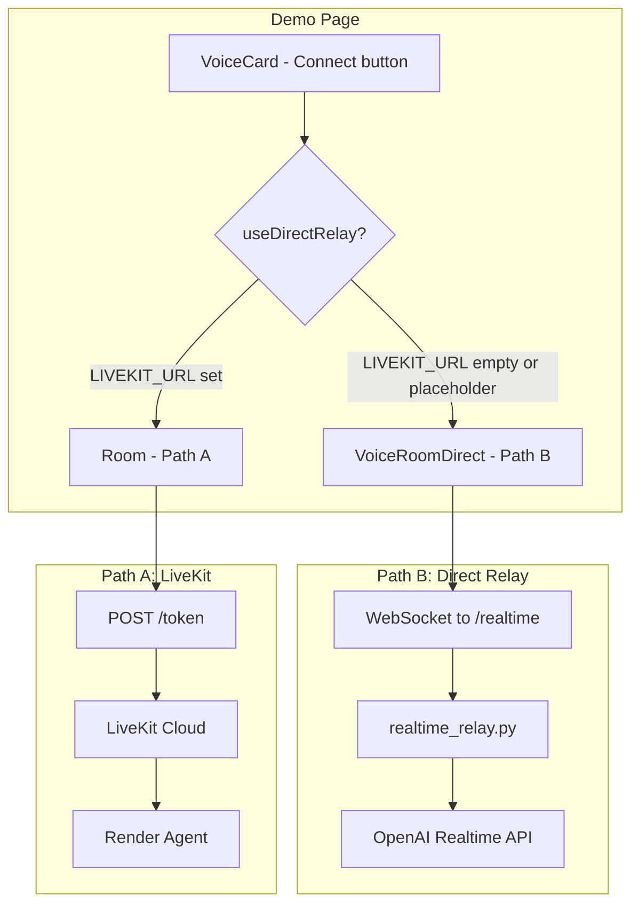

# Clarte Voice AI Pipeline

## Overview

The demo page supports two connection paths for the voice AI agent:

## Path Selection

- **Path A (Room):** LiveKit + Deepgram Aura. Requires `NEXT_PUBLIC_LIVEKIT_URL` and `NEXT_PUBLIC_VOICE_AGENT_URL`. Uses Render agent for full features (screen share, camera, Deepgram TTS).
- **Path B (VoiceRoomDirect):** WebSocket relay to OpenAI Realtime. Requires only `NEXT_PUBLIC_VOICE_AGENT_URL`. Uses OpenAI native audio (no Deepgram).

Placeholder URLs (`placeholder.livekit.cloud`, `placeholder.render.com`) from CI when secrets are missing are treated as "not configured" and trigger Path B with an error if `VOICE_AGENT_URL` is also placeholder.

## Path B Flow (VoiceRoomDirect)

1. User clicks Connect on VoiceCard.
2. Demo page loads `VoiceRoomDirect` when `useDirectRelay` is true.
3. VoiceRoomDirect fetches `/health` to warm up Render and verify reachability.
4. Opens WebSocket to `wss://{VOICE_AGENT_URL}/realtime`.
5. Captures mic via `getUserMedia`, resamples to 24kHz PCM, sends `input_audio_buffer.append` with base64 audio.
6. Relay (`realtime_relay.py`) forwards to OpenAI Realtime API; handles tools (search_web, etc.).
7. Receives `response.audio.delta` and `conversation.item.added` with `output_audio`; plays via AudioContext.

## Path A Flow (Room)

1. User clicks Connect; demo loads `Room`.
2. Room fetches token from `{VOICE_AGENT_URL}/token`.
3. Connects to LiveKit with token; Render agent joins.
4. Agent uses OpenAI Realtime + Deepgram TTS; audio flows via LiveKit.

## Environment Variables

| Variable | Where | Purpose |
|----------|-------|---------|
| `NEXT_PUBLIC_VOICE_AGENT_URL` | Frontend (build) | Render URL for token and /realtime |
| `NEXT_PUBLIC_LIVEKIT_URL` | Frontend (build) | LiveKit WebSocket URL (Path A only) |
| `NEXT_PUBLIC_USE_DIRECT_RELAY` | Frontend (build) | Force Path B when "true" |
| `OPENAI_API_KEY` | Render | Required for both paths |
| `LIVEKIT_*`, `DEEPGRAM_API_KEY` | Render | Path A only |

## Troubleshooting

- **"Set NEXT_PUBLIC_VOICE_AGENT_URL"** – Add the secret to GitHub Actions and rebuild.
- **"Cannot reach voice service"** – Check Render URL, service is running, and `/health` returns 200.
- **"Connection closed unexpectedly"** – Render may be cold-starting or restarting; retry after a few seconds.
- **WebSocket error** – Check Render logs for `OPENAI_API_KEY` and relay errors.
