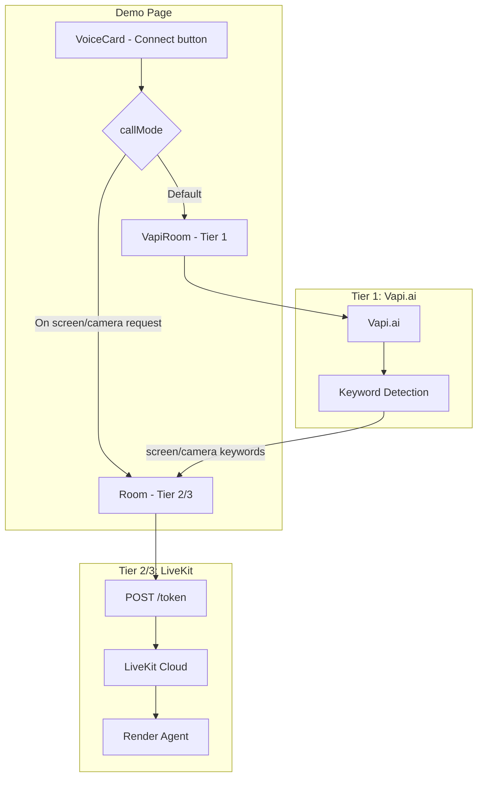

# Clarte Voice AI Pipeline

## Overview

The demo page supports two connection paths for the voice AI agent:

## Path Selection

- **Tier 1 (VapiRoom):** Vapi.ai voice-only. Requires `NEXT_PUBLIC_VAPI_PUBLIC_KEY` and `NEXT_PUBLIC_VAPI_ASSISTANT_ID`. Default flow. When user says "see my screen" or "look at me", auto-switches to LiveKit.
- **Tier 2/3 (Room):** LiveKit + Deepgram Aura. Requires `NEXT_PUBLIC_LIVEKIT_URL` and `NEXT_PUBLIC_VOICE_AGENT_URL`. Full features (screen share, camera, Deepgram TTS).

## Tier 1 Flow (VapiRoom)

1. User clicks Connect on VoiceCard.
2. Demo page loads `VapiRoom` (default).
3. VapiRoom uses `@vapi-ai/web` to connect to Vapi.ai with assistant ID.
4. Listens for user transcript via `vapi.on('message', ...)`.
5. When user says screen/camera keywords (e.g. "see my screen", "look at me"), calls `onSwitchToScreenMode` and switches to LiveKit Room.

## Tier 2/3 Flow (Room)

1. User clicks Connect (or switches from Vapi after screen/camera request); demo loads `Room`.
2. Room fetches token from `{VOICE_AGENT_URL}/token`.
3. Connects to LiveKit with token; Render agent joins.
4. Agent uses OpenAI Realtime + Deepgram TTS; audio flows via LiveKit.

## Environment Variables

| Variable | Where | Purpose |
|----------|-------|---------|
| `NEXT_PUBLIC_VAPI_PUBLIC_KEY` | Frontend (build) | Vapi.ai public API key (Tier 1) |
| `NEXT_PUBLIC_VAPI_ASSISTANT_ID` | Frontend (build) | Vapi.ai assistant ID (Tier 1) |
| `NEXT_PUBLIC_VOICE_AGENT_URL` | Frontend (build) | Render URL for token (Tier 2/3) |
| `NEXT_PUBLIC_LIVEKIT_URL` | Frontend (build) | LiveKit WebSocket URL (Tier 2/3 only) |
| `OPENAI_API_KEY` | Render | Required for Tier 2/3 |
| `LIVEKIT_*`, `DEEPGRAM_API_KEY` | Render | Tier 2/3 only |

## Troubleshooting

- **"Set NEXT_PUBLIC_VAPI_PUBLIC_KEY and NEXT_PUBLIC_VAPI_ASSISTANT_ID"** – Add Vapi keys to `.env.local` and rebuild.
- **"Cannot reach voice service"** – Check Render URL, service is running, and `/health` returns 200.
- **"Connection closed unexpectedly"** – Render may be cold-starting or restarting; retry after a few seconds.
- **Vapi call not starting** – Verify public key and assistant ID at [Vapi Dashboard](https://dashboard.vapi.ai).
